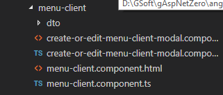
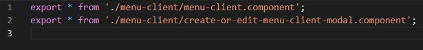
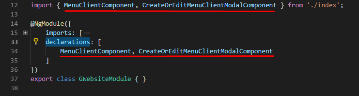
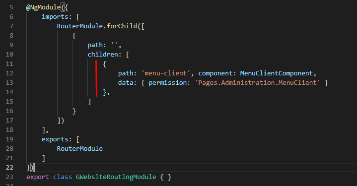
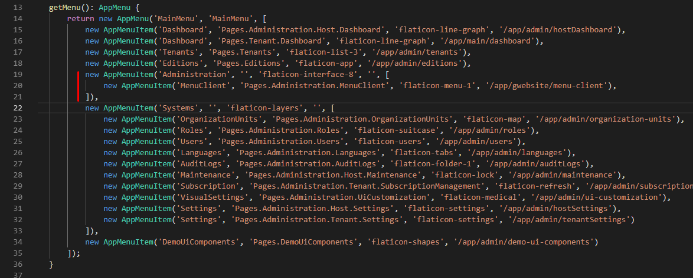

# Step by step Angular

## 1. Create comopnent
- Tạo component cho MenuClient như sau:
    - Tạo folder menu-client theo đường dẫn sau **src/app/gwebsite/**, sau đó tạo các file như sau:
    
    - create-or-edit-menu-client-modal.component thực hiện chức năng thêm hoặc sửa thông tin MenuClient
    - menu-client.component: show danh sách MenuClient.
    - dto: lưu các thông tin dto

- Tiếp theo, register các component này vào module
    - Export các component trong file index.ts theo đường dẫn **src/app/gwebsite/index.ts**
    
    - Mở gwebsite.module  theo đường dẫn **src/app/gwebsite/gwebsite.module.ts** và thêm component vào declarations
    

- Tạo routing cho menu-client.component
    - Mở gwebsite-routing.module theo đường dẫn **src/app/gwebsite/gwebsite-routing.module.ts** và thêm routing cho component
    

## 2. Tạo Menu cho component
- Mở app-navigation.service theo đường dẫn **src/app/shared/layout/nav/app-navigation.service.ts** và thêm menu như sau:

