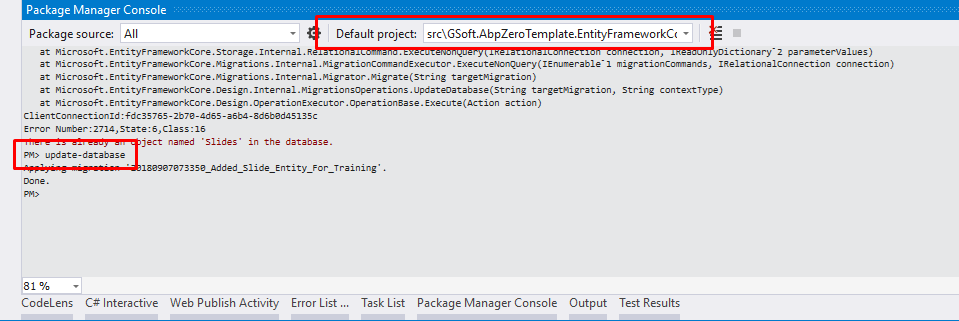
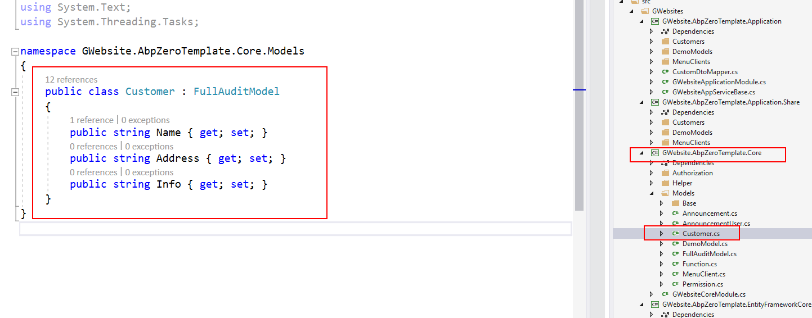
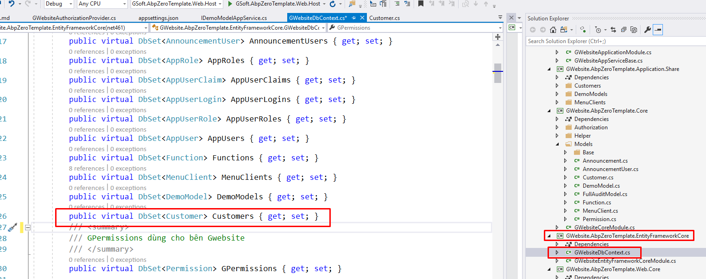
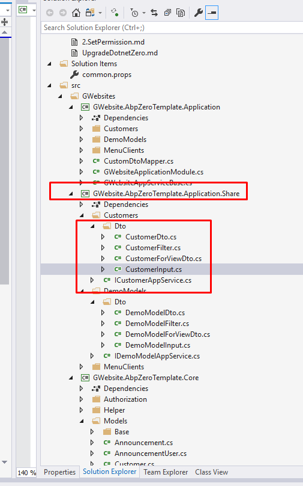
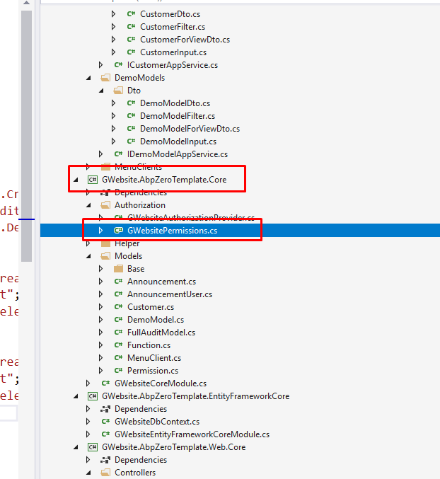
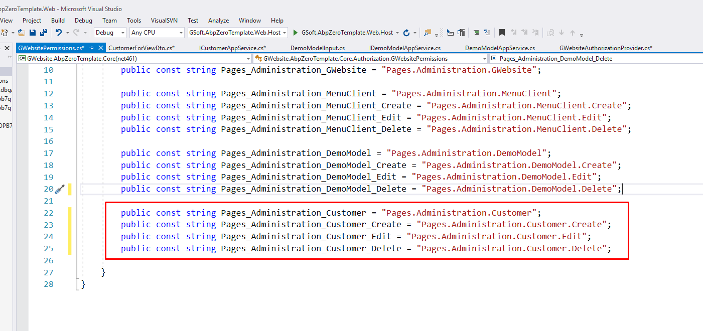
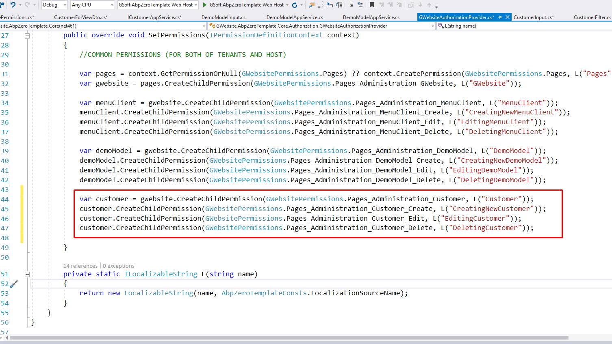
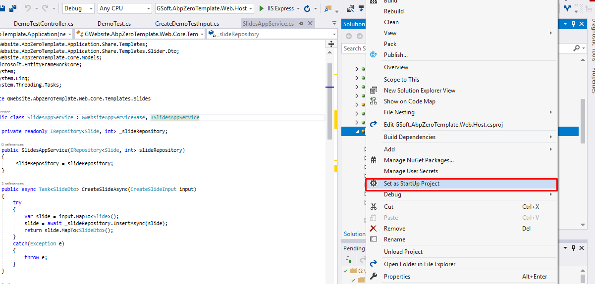
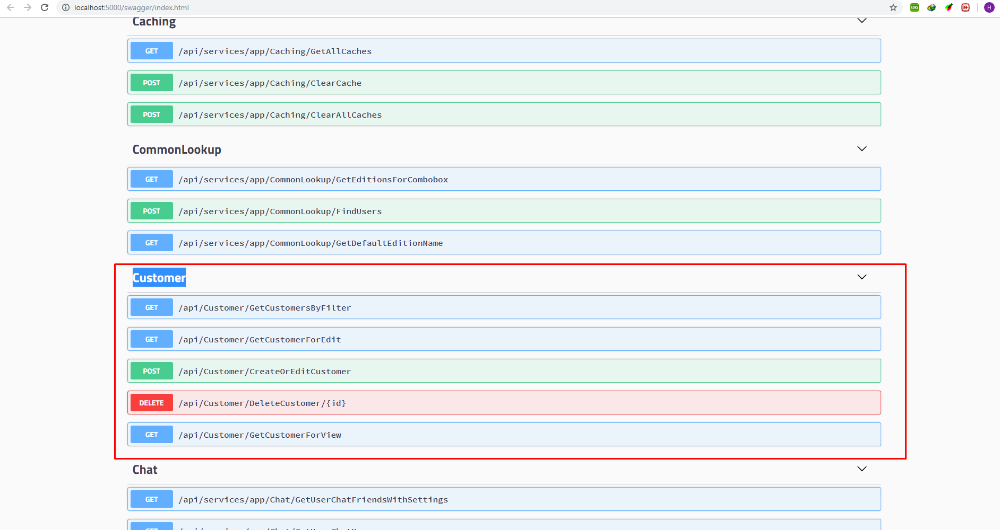

## Hướng dẫn cấu hình code
1. Chỉnh connection string sql
    - Mở apppsetting.json trong project GSoft.AbpZeroTemplate.Web.Host 
    ```JSON
     "ConnectionStrings": {
        "Default": "Server=<server-name>; Database=<database-name>; Trusted_Connection=True;"
    }
    ```
    - Mở apppsetting.json trong project GSoft.AbpZeroTemplate.Web.Mvc 
    ```JSON
     "ConnectionStrings": {
        "Default": "Server=<server-name>; Database=<database-name>; Trusted_Connection=True;"
    }
    ```
    - Vào Menu View -> Other Window -> Package Manager Console
    - Trong Package Manager Console Phần Default Project chọn GSoft.AbpZeroTemplate.EntityFrameworkCore
    - Run command line (Nhấn enter)
    ```CMD
    Update-Database
    ```
    
## Hướng dẫn tạo 1 Entity (Table database)
1. Tạo 1 Entity
    - Vào project GWebsite.AbpZeroTemplate.Core tạo 1 class là tên của Entity trong ví dụ này là Customer. Lưu ý Model phải kế thừa từ lớp FullAuditModel
     
    ```C#
    
    namespace GWebsite.AbpZeroTemplate.Core.Models
    {
        public class Customer : FullAuditModel
        {
            public string Name { get; set; }
            public string Address { get; set; }
            public string Info { get; set; }
        }
    }


    ```
2. Vào project GWebsite.AbpZeroTemplate.EntityFrameworkCore mở file GWebsiteDbContext.cs thêm đoạn code sau
     
     ```C#
    public virtual DbSet<Customer> Customers { get; set; }
    ```
3. Vào Package Manager Console  
    Phần Default Project chọn GSoft.AbpZeroTemplate.EntityFrameworkCore
    - Run command line
    ```CMD
    Add-Migration <migration-name>
    ```
    - Run command line
    ```CMD
    Update-Database
    ```
    
## Hướng dẫn tạo AppService (Code nghiệp vụ)
1.  Vào project GWebsite.AbpZeroTemplate.Application.Share tạo 1 thư mục là tên của entity + s/es
     
    -   Code các file như sau
    -   CustomerDto.cs
        -   Đây là lớp mô tả các đối tượng của bảng trong view
    ```C#
    using Abp.Domain.Entities;
    using GWebsite.AbpZeroTemplate.Core.Models;

    namespace GWebsite.AbpZeroTemplate.Application.Share.Customers.Dto
    {
        /// <summary>
        /// <model cref="Customer"></model>
        /// </summary>
        public class CustomerDto : Entity<int>
        {
            public string Name { get; set; }
            public string Address { get; set; }
            public string Info { get; set; }
        }
    }
    ```
       - CustomerFilter.cs
         - Đây là lớp mô tả đối tượng dùng để tìm kiếm. Ví dụ hiện tại hệ thống chỉ cần tìm kiếm theo name thì mô tả lớp như sau
    ```C#
    using GSoft.AbpZeroTemplate.Dto;
    using GWebsite.AbpZeroTemplate.Core.Models;
    using System;

    namespace GWebsite.AbpZeroTemplate.Application.Share.Customers.Dto
    {
        /// <summary>
        /// <model cref="Customer"></model>
        /// </summary>
        public class CustomerFilter : PagedAndSortedInputDto
        {
            public string Name { get; set; }
        }
    }
    ```
       - CustomerForViewDto.cs
         - Đây là lớp mô tả đối tượng của trang xem khách hàng
    ```C#
    using GWebsite.AbpZeroTemplate.Core.Models;

    namespace GWebsite.AbpZeroTemplate.Application.Share.Customers.Dto
    {
        /// <summary>
        /// <model cref="Customer"></model>
        /// </summary>
        public class CustomerForViewDto
        {
            public string Name { get; set; }
            public string Address { get; set; }
            public string Info { get; set; }
        }
    }
    ```
       - CustomerInput.cs
         - Đây là lớp mô tả đối tượng của trang thêm/ chỉnh sửa khách hàng
    ```C#
    using Abp.Domain.Entities;
    using GWebsite.AbpZeroTemplate.Core.Models;

    namespace GWebsite.AbpZeroTemplate.Application.Share.Customers.Dto
    {
        /// <summary>
        /// <model cref="Customer"></model>
        /// </summary>
        public class CustomerInput : Entity<int>
        {
            public string Name { get; set; }
            public string Address { get; set; }
            public string Info { get; set; }
        }
    }
    ```
       - IMenuClientAppService.cs
    ```C#
    using Abp.Application.Services.Dto;
    using GWebsite.AbpZeroTemplate.Application.Share.Customers.Dto;

    namespace GWebsite.AbpZeroTemplate.Application.Share.Customers
    {
        public interface ICustomerAppService
        {
            void CreateOrEditCustomer(CustomerInput customerInput);
            CustomerInput GetCustomerForEdit(int id);
            void DeleteCustomer(int id);
            PagedResultDto<CustomerDto> GetCustomers(CustomerFilter input);
            CustomerForViewDto GetCustomerForView(int id);
        }
    }
    ```
2.  Hướng dẫn tạo bộ phân quyền
    -   Vào project GWebsite.AbpZeroTemplate.Core chọn file GWebsitePermissions.cs
    -    
    -   Định nghĩa bộ phân quyền như sau
    -    
    -   Vào project GWebsite.AbpZeroTemplate.Core chọn file GWebsiteAuthorizationProvider.cs
    -   Tạo cây phân quyền như sau
    -    
3.  Vào project GWebsite.AbpZeroTemplate.Application tạo file CustomerAppService.cs

    ```C#
    using Abp.Application.Services.Dto;
    using Abp.Authorization;
    using Abp.Domain.Repositories;
    using Abp.Linq.Extensions;
    using GWebsite.AbpZeroTemplate.Application;
    using GWebsite.AbpZeroTemplate.Application.Share.Customers;
    using GWebsite.AbpZeroTemplate.Application.Share.Customers.Dto;
    using GWebsite.AbpZeroTemplate.Core.Authorization;
    using GWebsite.AbpZeroTemplate.Core.Models;
    using System.Linq;
    using System.Linq.Dynamic.Core;

    namespace GWebsite.AbpZeroTemplate.Web.Core.Customers
    {
        [AbpAuthorize(GWebsitePermissions.Pages_Administration_MenuClient)]
        public class CustomerAppService : GWebsiteAppServiceBase, ICustomerAppService
        {
            private readonly IRepository<Customer> customerRepository;

            public CustomerAppService(IRepository<Customer> customerRepository)
            {
                this.customerRepository = customerRepository;
            }

            #region Public Method

            public void CreateOrEditCustomer(CustomerInput customerInput)
            {
                if (customerInput.Id == 0)
                {
                    Create(customerInput);
                }
                else
                {
                    Update(customerInput);
                }
            }

            public void DeleteCustomer(int id)
            {
                var customerEntity = customerRepository.GetAll().Where(x => !x.IsDelete).SingleOrDefault(x => x.Id == id);
                if (customerEntity != null)
                {
                    customerEntity.IsDelete = true;
                    customerRepository.Update(customerEntity);
                    CurrentUnitOfWork.SaveChanges();
                }
            }

            public CustomerInput GetCustomerForEdit(int id)
            {
                var customerEntity = customerRepository.GetAll().Where(x => !x.IsDelete).SingleOrDefault(x => x.Id == id);
                if (customerEntity == null)
                {
                    return null;
                }
                return ObjectMapper.Map<CustomerInput>(customerEntity);
            }

            public CustomerForViewDto GetCustomerForView(int id)
            {
                var customerEntity = customerRepository.GetAll().Where(x => !x.IsDelete).SingleOrDefault(x => x.Id == id);
                if (customerEntity == null)
                {
                    return null;
                }
                return ObjectMapper.Map<CustomerForViewDto>(customerEntity);
            }

            public PagedResultDto<CustomerDto> GetCustomers(CustomerFilter input)
            {
                var query = customerRepository.GetAll().Where(x => !x.IsDelete);

                // filter by value
                if (input.Name != null)
                {
                    query = query.Where(x => x.Name.ToLower().Equals(input.Name));
                }

                var totalCount = query.Count();

                // sorting
                if (!string.IsNullOrWhiteSpace(input.Sorting))
                {
                    query = query.OrderBy(input.Sorting);
                }

                // paging
                var items = query.PageBy(input).ToList();

                // result
                return new PagedResultDto<CustomerDto>(
                    totalCount,
                    items.Select(item => ObjectMapper.Map<CustomerDto>(item)).ToList());
            }

            #endregion

            #region Private Method

            [AbpAuthorize(GWebsitePermissions.Pages_Administration_MenuClient_Create)]
            private void Create(CustomerInput customerInput)
            {
                var customerEntity = ObjectMapper.Map<Customer>(customerInput);
                SetAuditInsert(customerEntity);
                customerRepository.Insert(customerEntity);
                CurrentUnitOfWork.SaveChanges();
            }

            [AbpAuthorize(GWebsitePermissions.Pages_Administration_MenuClient_Edit)]
            private void Update(CustomerInput customerInput)
            {
                var customerEntity = customerRepository.GetAll().Where(x => !x.IsDelete).SingleOrDefault(x => x.Id == customerInput.Id);
                if (customerEntity == null)
                {
                }
                ObjectMapper.Map(customerInput, customerEntity);
                SetAuditEdit(customerEntity);
                customerRepository.Update(customerEntity);
                CurrentUnitOfWork.SaveChanges();
            }

            #endregion
        }
    }
    ```
4.  Vào GWebsite.AbpZeroTemplate.Application chọn file CustomDtoMapper.cs thêm đoạn code này
    ```C#
    configuration.CreateMap<Customer, CustomerDto>();
    configuration.CreateMap<CustomerInput, Customer>();
    configuration.CreateMap<Customer, CustomerInput>();
    configuration.CreateMap<Customer, CustomerForViewDto>();
    ```
## Hướng dẫn tạo WebAPI
1.  Vào project GWebsite.AbpZeroTemplate.Web.Core tạo class MenuClientController
    ```C#
    using Abp.Application.Services.Dto;
    using GWebsite.AbpZeroTemplate.Application.Share.Customers;
    using GWebsite.AbpZeroTemplate.Application.Share.Customers.Dto;
    using Microsoft.AspNetCore.Mvc;

    namespace GWebsite.AbpZeroTemplate.Application.Controllers
    {
        [Route("api/[controller]/[action]")]
        public class CustomerController : GWebsiteControllerBase
        {
            private readonly ICustomerAppService customerAppService;

            public CustomerController(ICustomerAppService customerAppService)
            {
                this.customerAppService = customerAppService;
            }

            [HttpGet]
            public PagedResultDto<CustomerDto> GetCustomersByFilter(CustomerFilter customerFilter)
            {
                return customerAppService.GetCustomers(customerFilter);
            }

            [HttpGet]
            public CustomerInput GetCustomerForEdit(int id)
            {
                return customerAppService.GetCustomerForEdit(id);
            }

            [HttpPost]
            public void CreateOrEditCustomer([FromBody] CustomerInput input)
            {
                customerAppService.CreateOrEditCustomer(input);
            }

            [HttpDelete("{id}")]
            public void DeleteCustomer(int id)
            {
                customerAppService.DeleteCustomer(id);
            }

            [HttpGet]
            public CustomerForViewDto GetCustomerForView(int id)
            {
                return customerAppService.GetCustomerForView(id);
            }
        }
    }
    ```
## Hướng dẫn test API
1.  Chọn GSoft.AbpZeroTemplate.Web.Host là default project và chạy chương trình bằng ctrl f5
    

2.  Kết quả hiện lên màn hình swagger là thành công bước tạo web api
    
