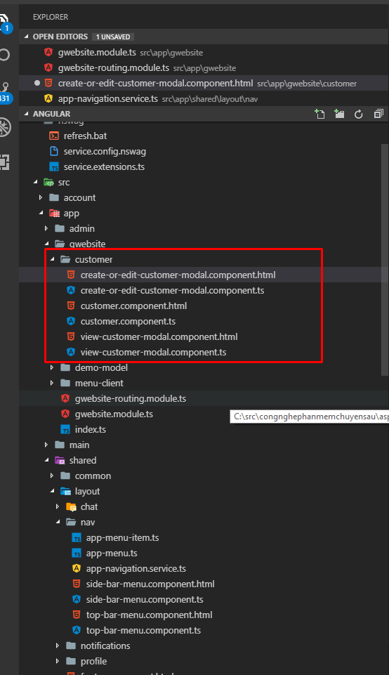
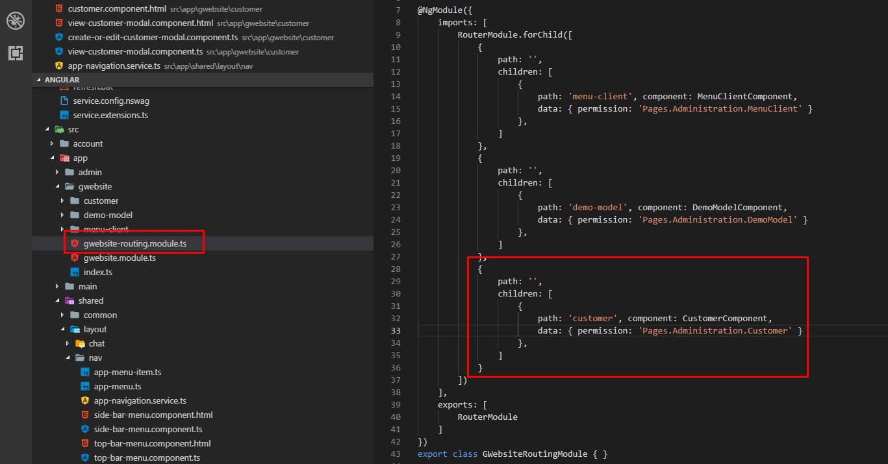
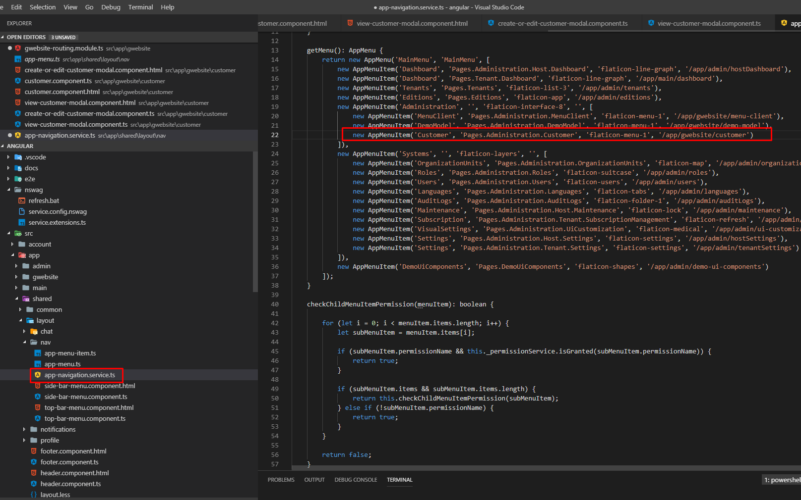

## Hướng dẫn cài đặt angular
-   Cài nodejs: https://nodejs.org/en/download/
-   Vào cmd trỏ vào thư mục angular gõ
    -   npm install
    -   npm start

## Hướng dẫn code angular
-   Sử dụng IDE gì code cũng được (Visual Studio, Visual Code) trong bài viết này sẽ sử dụng Visual Code
1. Tạo service từ web api
    - Như hướng dẫn web api các bạn đã tạo được danh sách các web api chuẩn để code. Bước này sẽ tạo những câu lệnh map với những web api đó để sử dụng

    - Chạy web api ở swagger
    - Thưc thi file angular\nswag\ refresh.bat

2. Tạo component và html
    Tạo cấu trúc file như sau
    - 
      - customer.component.ts
        - Đây là lớp xử lý giao diện của trang list/filter khách hàng
    ```javascript
    import { ViewCustomerModalComponent } from './view-customer-modal.component';
    import { AfterViewInit, Component, ElementRef, Injector, OnInit, ViewChild } from '@angular/core';
    import { ActivatedRoute, Params, Router } from '@angular/router';
    import { appModuleAnimation } from '@shared/animations/routerTransition';
    import { AppComponentBase } from '@shared/common/app-component-base';
    import * as _ from 'lodash';
    import { LazyLoadEvent } from 'primeng/components/common/lazyloadevent';
    import { Paginator } from 'primeng/components/paginator/paginator';
    import { Table } from 'primeng/components/table/table';
    import { CustomerServiceProxy } from '@shared/service-proxies/service-proxies';
    import { CreateOrEditCustomerModalComponent } from './create-or-edit-customer-modal.component';

    @Component({
        templateUrl: './customer.component.html',
        animations: [appModuleAnimation()]
    })
    export class CustomerComponent extends AppComponentBase implements AfterViewInit, OnInit {

        /**
        * @ViewChild là dùng get control và call thuộc tính, functions của control đó
        */
        @ViewChild('dataTable') dataTable: Table;
        @ViewChild('paginator') paginator: Paginator;
        @ViewChild('createOrEditModal') createOrEditModal: CreateOrEditCustomerModalComponent;
        @ViewChild('viewCustomerModal') viewCustomerModal: ViewCustomerModalComponent;

        /**
        * tạo các biến dể filters
        */
        customerName: string;

        constructor(
            injector: Injector,
            private _customerService: CustomerServiceProxy,
            private _activatedRoute: ActivatedRoute,
        ) {
            super(injector);
        }

        /**
        * Hàm xử lý trước khi View được init
        */
        ngOnInit(): void {
        }

        /**
        * Hàm xử lý sau khi View được init
        */
        ngAfterViewInit(): void {
            setTimeout(() => {
                this.init();
            });
        }

        /**
        * Hàm get danh sách Customer
        * @param event
        */
        getCustomers(event?: LazyLoadEvent) {
            if (!this.paginator || !this.dataTable) {
                return;
            }

            //show loading trong gridview
            this.primengTableHelper.showLoadingIndicator();

            /**
            * mặc định ban đầu lấy hết dữ liệu nên dữ liệu filter = null
            */

            this.reloadList(null, event);

        }

        reloadList(customerName, event?: LazyLoadEvent) {
            this._customerService.getCustomersByFilter(customerName, this.primengTableHelper.getSorting(this.dataTable),
                this.primengTableHelper.getMaxResultCount(this.paginator, event),
                this.primengTableHelper.getSkipCount(this.paginator, event),
            ).subscribe(result => {
                this.primengTableHelper.totalRecordsCount = result.totalCount;
                this.primengTableHelper.records = result.items;
                this.primengTableHelper.hideLoadingIndicator();
            });
        }

        deleteCustomer(id): void {
            this._customerService.deleteCustomer(id).subscribe(() => {
                this.reloadPage();
            })
        }

        init(): void {
            //get params từ url để thực hiện filter
            this._activatedRoute.params.subscribe((params: Params) => {
                this.customerName = params['name'] || '';
                this.reloadList(this.customerName, null);
            });
        }

        reloadPage(): void {
            this.paginator.changePage(this.paginator.getPage());
        }

        applyFilters(): void {
            //truyền params lên url thông qua router
            this.reloadList(this.customerName, null);

            if (this.paginator.getPage() !== 0) {
                this.paginator.changePage(0);
                return;
            }
        }

        //hàm show view create MenuClient
        createCustomer() {
            this.createOrEditModal.show();
        }

        /**
        * Tạo pipe thay vì tạo từng hàm truncate như thế này
        * @param text
        */
        truncateString(text): string {
            return abp.utils.truncateStringWithPostfix(text, 32, '...');
        }
    }
    ```
      - customer.component.html
        - Đây là trang html mô tả tìm kiếm sort filter khách hàng
    ```html
    <div [@routerTransition]>

    <div class="m-subheader ">
        <div class="d-flex align-items-center">
            <div class="mr-auto col-xs-6">
                <h3 class="m-subheader__title m-subheader__title--separator">
                    <span>{{l("Customer")}}</span>
                </h3>
                <span class="m-section__sub">
                    {{l("CustomerInfo")}}
                </span>
            </div>
            <div class="col-xs-6 text-right">
                <button (click)="createCustomer()" *ngIf="isGranted('Pages.Administration.Customer.Create')"
                    class="btn btn-primary"><i class="fa fa-plus"></i> {{l("CreateNewCustomer")}}</button>
            </div>
        </div>
    </div>

    <div class="m-content">
        <div class="m-portlet m-portlet--mobile">
            <div class="m-portlet__body">
                <form autocomplete="off">
                    <div class="m-form m-form--label-align-right" id="TextsFilterForm">
                        <div class="row align-items-center m--margin-bottom-10">
                            <div class="col-sm-12">
                                <div class="input-group">
                                    <input [(ngModel)]="customerName" name="customerName" autoFocus class="form-control"
                                        placeholder="Nhập tên khách hàng" type="text">
                                    <span class="input-group-btn">
                                        <button (click)="applyFilters()" class="btn btn-primary" type="submit"><i
                                                class="icon-refresh"></i>
                                            {{l("Refresh")}}</button>
                                    </span>
                                </div>
                            </div>
                        </div>
                    </div>
                </form>
                <div class="row align-items-center">
                    <!--<Primeng-TurboTable-Start>-->
                    <div class="primeng-datatable-container" [busyIf]="primengTableHelper.isLoading">
                        <p-table #dataTable (onLazyLoad)="getCustomers($event)" [value]="primengTableHelper.records"
                            rows="{{primengTableHelper.defaultRecordsCountPerPage}}" [paginator]="false" [lazy]="true"
                            [responsive]="primengTableHelper.isResponsive">
                            <ng-template pTemplate="header">
                                <tr>
                                    <th pSortableColumn="name">
                                        Tên khách hàng
                                        <p-sortIcon field="name"></p-sortIcon>
                                    </th>
                                    <th pSortableColumn="address">
                                        Địa chỉ
                                    </th>
                                    <th pSortableColumn="info">
                                        Thông tin
                                        <p-sortIcon field="info"></p-sortIcon>
                                    </th>
                                    <th>{{l('Edit')}}</th>
                                </tr>
                            </ng-template>
                            <ng-template pTemplate="body" let-record="$implicit">
                                <tr>
                                    <td>
                                        <span class="ui-column-title">Tên khách hàng</span>
                                        <span title="{{record.name}}">{{truncateString(record.name)}}</span>
                                    </td>
                                    <td>
                                        <span class="ui-column-title">Địa chỉ</span>
                                        <span title="{{record.address}}">{{truncateString(record.address)}}</span>
                                    </td>
                                    <td>
                                        <span class="ui-column-title">Thông tin</span>
                                        <span title="{{record.info}}">{{truncateString(record.info)}}</span>
                                    </td>
                                    <td>
                                        <button
                                            class="btn m-btn m-btn--hover-accent m-btn--icon m-btn--icon-only m-btn--pill"
                                            (click)="createOrEditModal.show(record.id)" title="{{l('Edit')}}">
                                            <i class="fa fa-edit" [attr.aria-label]="l('Edit')"></i>
                                        </button>

                                        <button
                                            class="btn m-btn m-btn--hover-accent m-btn--icon m-btn--icon-only m-btn--pill"
                                            (click)="deleteCustomer(record.id)" title="{{l('Delete')}}">
                                            <i class="fa fa-times" [attr.aria-label]="l('Delete')"></i>
                                        </button>

                                        <button
                                            class="btn m-btn m-btn--hover-accent m-btn--icon m-btn--icon-only m-btn--pill"
                                            (click)="viewCustomerModal.show(record.id)" title="{{l('View')}}">
                                            <i class="fa fa-eye" [attr.aria-label]="l('View')"></i>
                                        </button>
                                    </td>
                                </tr>
                            </ng-template>
                        </p-table>
                        <div class="primeng-no-data" *ngIf="primengTableHelper.totalRecordsCount == 0">
                            {{l('NoData')}}
                        </div>
                        <div class="primeng-paging-container">
                            <p-paginator rows="{{primengTableHelper.defaultRecordsCountPerPage}}" #paginator
                                (onPageChange)="getCustomers($event)"
                                [totalRecords]="primengTableHelper.totalRecordsCount"
                                [rowsPerPageOptions]="primengTableHelper.predefinedRecordsCountPerPage">
                            </p-paginator>
                            <span class="total-records-count">
                                {{l('TotalRecordsCount', primengTableHelper.totalRecordsCount)}}
                            </span>
                        </div>
                    </div>
                    <!--<Primeng-TurboTable-End>-->
                </div>
            </div>
        </div>
    </div>
    <createOrEditCustomerModal #createOrEditModal (modalSave)="reloadPage()"></createOrEditCustomerModal>
    <viewCustomerModal #viewCustomerModal></viewCustomerModal>
    </div>
    ```
      - create-or-edit-customer-modal.component.ts
        - Đây là lớp xử lý giao diện của trang tạo/sửa khách hàng
    ```javascript
    import { Component, ElementRef, EventEmitter, Injector, Output, ViewChild } from '@angular/core';
    import { AppComponentBase } from '@shared/common/app-component-base';
    import { ModalDirective } from 'ngx-bootstrap';
    import { CustomerServiceProxy, CustomerInput } from '@shared/service-proxies/service-proxies';


    @Component({
        selector: 'createOrEditCustomerModal',
        templateUrl: './create-or-edit-customer-modal.component.html'
    })
    export class CreateOrEditCustomerModalComponent extends AppComponentBase {


        @ViewChild('createOrEditModal') modal: ModalDirective;
        @ViewChild('customerCombobox') customerCombobox: ElementRef;
        @ViewChild('iconCombobox') iconCombobox: ElementRef;
        @ViewChild('dateInput') dateInput: ElementRef;


        /**
        * @Output dùng để public event cho component khác xử lý
        */
        @Output() modalSave: EventEmitter<any> = new EventEmitter<any>();

        saving = false;

        customer: CustomerInput = new CustomerInput();

        constructor(
            injector: Injector,
            private _customerService: CustomerServiceProxy
        ) {
            super(injector);
        }

        show(customerId?: number | null | undefined): void {
            this.saving = false;


            this._customerService.getCustomerForEdit(customerId).subscribe(result => {
                this.customer = result;
                this.modal.show();

            })
        }

        save(): void {
            let input = this.customer;
            this.saving = true;
            this._customerService.createOrEditCustomer(input).subscribe(result => {
                this.notify.info(this.l('SavedSuccessfully'));
                this.close();
            })

        }

        close(): void {
            this.modal.hide();
            this.modalSave.emit(null);
        }
    }
    ```
       - create-or-edit-customer-modal.component.html
         - Đây là file mô tả layout html của trang thêm/cập nhật khách hàng
    ```html
    <div bsModal #createOrEditModal="bs-modal" class="modal fade" tabindex="-1" role="dialog"
    aria-labelledby="createOrEditModal" aria-hidden="true" [config]="{backdrop: 'static'}">
        <div class="modal-dialog modal-lg">
            <div class="modal-content">
                <form #editForm="ngForm" novalidate (ngSubmit)="save()">
                    <div class="modal-header">
                        <h4 class="modal-title">
                            <span *ngIf="customer.id">Cập nhật khách hàng: {{customer.name}}</span>
                            <span *ngIf="!customer.id">Tạo mới khách hàng</span>
                        </h4>
                        <button type="button" class="close" (click)="close()" [attr.aria-label]="l('Close')">
                            <span aria-hidden="true">&times;</span>
                        </button>
                    </div>
                    <div class="modal-body">
                        <div class="form-group">
                            <label>Tên khách hàng *</label>
                            <input #nameInput="ngModel" class="form-control" type="text" name="Name"
                                [(ngModel)]="customer.name" required maxlength="64">
                            <validation-messages [formCtrl]="nameInput"></validation-messages>
                        </div>
                        <div class="form-group">
                            <label>Địa chỉ *</label>
                            <input #addressInput="ngModel" class="form-control" type="text" name="Address"
                                [(ngModel)]="customer.address" required maxlength="64">
                            <validation-messages [formCtrl]="addressInput"></validation-messages>
                        </div>
                        <div class="form-group">
                            <label>Thông tin *</label>
                            <input #addressInput="ngModel" class="form-control" type="text" name="Info"
                                [(ngModel)]="customer.info" required maxlength="64">
                            <validation-messages [formCtrl]="infoInput"></validation-messages>
                        </div>
                    </div>
                    <div class="modal-footer">
                        <button [disabled]="saving" type="button" class="btn btn-default"
                            (click)="close()">{{l("Cancel")}}</button>
                        <button type="submit" class="btn btn-primary" [buttonBusy]="saving"
                            [busyText]="l('SavingWithThreeDot')"><i class="fa fa-save"></i>
                            <span>{{l("Save")}}</span></button>
                    </div>
                </form>
            </div>
        </div>
    </div>
    ```
    - view-customer-modal.component.ts
    ```javascript
    import { CustomerForViewDto } from './../../../shared/service-proxies/service-proxies';
    import { AppComponentBase } from "@shared/common/app-component-base";
    import { AfterViewInit, Injector, Component, ViewChild } from "@angular/core";
    import { CustomerServiceProxy } from "@shared/service-proxies/service-proxies";
    import { ModalDirective } from 'ngx-bootstrap';

    @Component({
        selector: 'viewCustomerModal',
        templateUrl: './view-customer-modal.component.html'
    })

    export class ViewCustomerModalComponent extends AppComponentBase {

        customer : CustomerForViewDto = new CustomerForViewDto();
        @ViewChild('viewModal') modal: ModalDirective;

        constructor(
            injector: Injector,
            private _customerService: CustomerServiceProxy
        ) {
            super(injector);
        }

        show(customerId?: number | null | undefined): void {
            this._customerService.getCustomerForView(customerId).subscribe(result => {
                this.customer = result;
                this.modal.show();
            })
        }

        close() : void{
            this.modal.hide();
        }
    }
    ```
    - view-customer-modal.component.html
    ```html
    <div bsModal #viewModal="bs-modal" class="modal fade" tabindex="-1" role="dialog" aria-labelledby="viewModal"
    aria-hidden="true" [config]="{backdrop: 'static'}">
        <div class="modal-dialog modal-lg">
            <div class="modal-content">
                <div class="modal-header">
                    <h4 class="modal-title">
                        <span *ngIf="customer.id">{{l("EditCustomer")}}: {{customer.name}}</span>
                        <span *ngIf="!customer.id">{{l("CreateNewCustomer")}}</span>
                    </h4>
                    <button type="button" class="close" (click)="close()" [attr.aria-label]="l('Close')">
                        <span aria-hidden="true">&times;</span>
                    </button>
                </div>
                <div class="modal-body">
                    <div class="form-group">
                        <label>Tên khách hàng</label>
                        <p>{{customer.name}}</p>
                    </div>
                    <div class="form-group">
                        <label>Địa chỉ</label>
                        <p>{{customer.address}}</p>
                    </div>
                    <div class="form-group">
                        <label>Thông tin</label>
                        <p>{{customer.info}}</p>
                    </div>
                </div>
                <div class="modal-footer">
                    <button [disabled]="saving" type="button" class="btn btn-default"
                        (click)="close()">{{l("Cancel")}}</button>
                    <button type="submit" class="btn btn-primary" [buttonBusy]="saving"
                        [busyText]="l('SavingWithThreeDot')"><i class="fa fa-save"></i>
                        <span>{{l("Save")}}</span></button>
                </div>
            </div>
        </div>
    </div>
    ```
3.  Cấu hình routing và module
    - Vào app\gwebsite\gwebsite.module.ts chỉnh sửa như sau

    - Vào app\gwebsite\gwebsite-routing.module.ts chỉnh sửa như sau
    - 
4.  Thêm vào menu
    - Vào app\shared\layout\nav\app-navigation.service.ts
    ```javascript
    new AppMenuItem('Customer', 'Pages.Administration.Customer', 'flaticon-menu-1', '/app/gwebsite/customer')
    ```
    - 